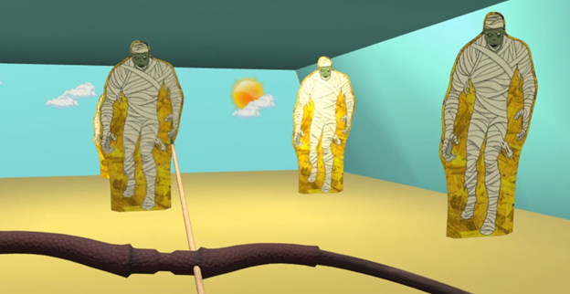

# Satet’s Shooting Range

## Introduction

**Satet’s Shooting Range** is an egyption-themed shooting-gallery game where you defend against waves of enemies with bow and arrows in VR! 

As a player, what you need to do is that grab a VR bow and use arrow shootings to defend against challenging hordes of enemies and try to hit the highest score.

## Build And Install

* Acquire SteamVR compatible headset and motion controllers.

* Install SteamVR via Steam.

* Extract “Satet Build” zip file from the “Build” folder.

* Run “Satet’s Shooting Range.exe”, game should launch automatically.

## How to play

The goal is to survive as long as you can and increment high scores.

Nock the arrow into your bow by placing it on the notch and pressing trigger.

Pull back to empower your shot.

Release trigger to fire.

Shoot at the mummies to keep them from getting to your three lane walls.

If a mummy reaches a wall, the wall will be destroyed.

If a mummy reaches a wall-less location, you will die.

Shoot the Reset button on the score board to start all over again!

Enjoy the popcorn!

## Publishing

Find published build at: <https://twilitwave.itch.io/satets-shooting-range>

## Team Contact Info

Andrew Corum (Producer) – [andrewRcorum@gmail.com](mailto:andrewRcorum@gmail.com)

Brady Campbell (Tech Art) – [Bradycampbellk12@gmail.com](mailto:Bradycampbellk12@gmail.com)

Jacob Nielsen (Producer) – [TwilitWave@gmail.com](mailto:TwilitWave@gmail.com)

Pluto She (Engineer) – [plutoshe@gmail.com](mailto:plutoshe@gmail.com)

Tezika Zhou (Engineer) – [tezikazhou@gmail.com](mailto:tezikazhou@gmail.com)

Zach Gainer (Artist) – [gainer.zach@gmail.com](mailto:gainer.zach@gmail.com)